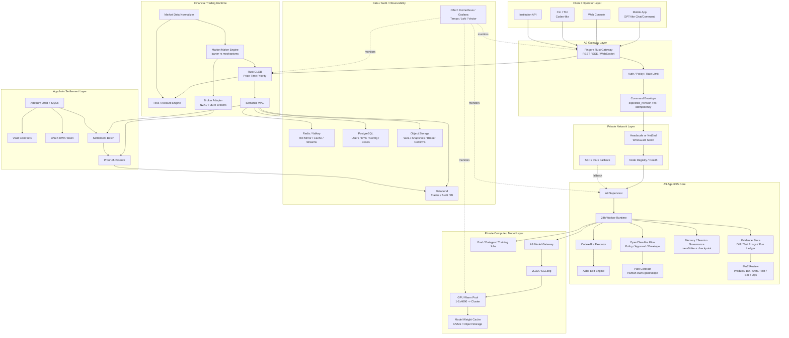

# A9 AgentOS 金融交易环境重构决策包

> 版本：v0.1  
> 日期：2026-06-04  
> 范围：A9 AgentOS 金融交易环境、NZX RWA Orderbook Appchain 第一业务项目、弹性算力/模型调度、参考项目吸收路线、当前代码重构/删除优先级。  
> 定位：这是架构决策包与执行路线，不是法律意见、牌照意见、投资建议，也不是最终商业宣传稿。

---

## 0. 最终结论

A9 不是普通 App、普通后台、普通量化系统、普通 VPN、普通交易所，也不是一个单独 AI worker。

A9 的最终定位应定为：

```text
A9 = 私有 AgentOS 金融交易环境底座
   = 金融交易基础设施控制面
   + 24h Agent 执行系统
   + 私有算力/模型调度层
   + 高性能交易运行环境
   + ResearchOps / 训练数据闭环
```

NZX RWA Orderbook Appchain 是 A9 底座上跑的第一条重业务主线，不是 A9 的全部。

弹性算力是 A9 的私有模型和 Agent 执行能力的一层，不是当前主线本身；算力 RWA / 算力币 / DePIN 是长期候选商业飞轮，不进入第一刀架构执行。

最关键的一句话：

```text
先重构 A9 AgentOS 金融交易底座，
再在这个底座上承载 NZX RWA Orderbook Appchain、移动远程控制、弹性算力、AI Agent 24h 执行、交易监控和后续业务应用。
```

---

## 1. A9 的根主线

A9 的根主线不是“做一个功能”，而是把一套交易工程哲学固化成持续运行的系统。

核心公式：

```text
交易哲学
-> 交易逻辑
-> 风险边界
-> 数据验证
-> 最小策略闭环
-> 工程架构
-> TDD / 压测 / 监控
-> 小资金实盘
-> 归因优化
-> AI 辅助迭代
```

工程方法：

```text
找对标
-> 抽机制
-> 能抄绝不手搓
-> 多项目融合
-> 小步魔改
-> Diff / Git / Sandbox 管住
-> 数据验证
-> 压测
-> 监控
-> 轨迹入库
-> 训练 / 蒸馏私有金融交易工程模型
```

这里的“抄抄抄”必须升级为工程纪律：

```text
抄源码之前先验 license / commit / NOTICE / vendor manifest；
能直接 vendor 的小模块直接 vendor；
大项目只抄机制、边界、失败治理、数据结构和产品交互；
不能把整仓库塞进 A9，也不能把未核验 license 的项目 copy 入体。
```

---

## 2. A9 与 NZX 的层级关系

必须把两者分开：

```text
A9 AgentOS 金融交易环境 = 底座 / 控制面 / 执行环境 / 研究和训练闭环
NZX RWA Orderbook Appchain = 第一条重业务应用
```

错误理解：

```text
A9 = NZX 交易所
A9 = 手机 App
A9 = AI worker
A9 = VPN 网关
A9 = 单一量化策略
```

正确理解：

```text
A9 底座可以承载：
- NZX RWA Orderbook Appchain
- 后续其他交易所 RWA 项目
- 内部高性能交易服务
- 私有 AI Agent 研发执行系统
- 移动远程控制工作台
- 私有算力 / 模型调度
- 监控、证据、复盘、训练数据闭环
```

---

## 3. A9 最高形态分层架构

```text
用户 / 交易员 / 研发 / 运维 / 合规 / 做市商 / 机构 API
        |
        v
Web / Mobile / CLI / API Client
        |
        v
顶级入口与网关层
  Pingora / Rust Gateway
  Auth / Policy / Rate Limit / REST / SSE / WebSocket / Command Envelope
        |
        v
私有网络与多机器接入层
  Headscale / NetBird / WireGuard
  SSH / tmux fallback
  Node Registry / Node Onboarding / Health
        |
        v
A9 AgentOS 智能控制层
  Supervisor / 24h Worker / Codex-like Client
  OpenClaw-like Flow / Policy / Approval / Envelope
  Plan Contract / Session Governance / Memory Commit
  MoE Review / Evidence Store / Run Ledger
        |
        v
私有算力与模型调度层
  A9 Model Gateway
  vLLM / SGLang / Local 4090 / Warm Pool
  GPU Node Pool / Weight Cache / Image Prepull
  Training / Eval / Datagen / Cloud Burst
        |
        v
金融交易业务服务层
  Rust CLOB / WAL / Risk / Account
  Market Maker / barter-rs Mechanisms
  Market Data / Broker Adapter / Proof
        |
        v
Appchain 与资产结算层
  Arbitrum Orbit + Stylus / Rust Contracts
  Vault / wNZX / Settlement Batch / Timelock / Proof-of-Reserve
        |
        v
数据、审计、监控层
  Redis / Valkey / Dragonfly Hot Mirror
  PostgreSQL Canonical Business State
  Databend Historical Audit / OLAP
  Object Storage / WAL Segments / Snapshots
  OpenTelemetry / Prometheus / Grafana / Loki / Tempo / Vector
```

---

## 4. 服务全景图



---

## 5. 参考项目选择：哪些直接入体，哪些只抄机制

### 5.1 最高原则

参考项目分四类：

| 类型 | 含义 | 处理方式 |
|---|---|---|
| S 级直接入体 | license 明确、边界清晰、模块可小范围 vendor | 复制小模块或子目录，写入 `vendor-src/VENDOR_MANIFEST.toml` |
| A 级强机制复制 | 项目机制对 A9 很关键，但源码边界大或语言/依赖不适合 | 抄数据模型、状态机、错误治理、产品交互，不直接整仓 copy |
| B 级旁路参考 | 长期有价值，但不进入热路径 | 做 sidecar、wiki、graph、eval，不影响核心执行 |
| 禁止主线 | 会引起合规/安全/维护风险 | 不进入主交易链路，不作为产品卖点 |

### 5.2 S 级：建议直接 copy / vendor 入体的项目或模块

注意：这里的“直接 copy 入体”不是整仓搬运，而是“可审计小模块 + vendor manifest + license 保留 + commit 固定”。

#### 1. Codex CLI / OpenAI Codex

用途：

```text
agent loop
context / compact
sandbox / tool execution
conversation event model
exec/resume 心智
CLI/TUI 任务交互
```

进入方式：

```text
vendor-src/codex/<commit>/
crates/a9-agent-exec/
crates/a9-codex-adapter/
```

A9 不应整仓替换成 Codex，而应把 Codex 作为 A9 的 coding executor 和 session event 参考。

#### 2. Aider

用途：

```text
repo map
SEARCH/REPLACE patch discipline
deterministic edit apply
diff guard
```

进入方式：

```text
vendor-src/aider/<commit>/
crates/a9-edit/
scripts/a9_patch_apply.py 过渡迁移到 Rust edit engine
```

Aider 的价值不是聊天，而是“让 24h worker 改代码不乱改”。

#### 3. barter-rs

用途：

```text
market data stream
exchange connector / broker adapter 思路
reconnect backoff
stream error action
strategy / market maker framework
inventory / audit state replica
```

进入方式：

```text
vendor-src/barter-rs/<commit>/
crates/a9-market/
crates/a9-mm/
crates/a9-broker/
```

明确边界：

```text
barter-rs 不做 A9 CLOB 撮合内核；
barter-rs 做信号网关、行情网关、做市策略、券商/交易所连接和异常治理。
```

#### 4. planning-with-files

用途：

```text
文件化计划
中断恢复
PreCompact / Stop hooks
parallel isolation
attestation
```

进入方式：

```text
crates/a9-plan/
docs/execution_next/*.md
run evidence re-injection hooks
```

不能照搬：

```text
不能让 worker 拥有 plan 的目标、范围和验收标准。
Plan ownership 属于 human / product / requirements / monitor。
```

#### 5. aichat / provider 工具抽象

用途：

```text
Rust CLI provider abstraction
model routing
local/provider config
simple tool bridge
```

进入方式：

```text
crates/a9-model-gateway/
crates/a9-cli/
```

需要先做 license 和依赖核验。

---

### 5.3 A 级：强机制复制，不先 copy 源码

#### OpenClaw / Lobster 类 managed flow

用途：

```text
managed workflow
approval wait / resume
strict envelope
policy attestation
plugin boundary
memory governance
```

处理：

```text
先抄状态机和 envelope，不先整仓 copy。
如果本地 license 确认 MIT 且模块边界清晰，再进入 vendor-src。
```

#### LangGraph

用途：

```text
checkpoint lineage
channel history
graph workflow
recoverable state machine
```

处理：

```text
A9 需要 LangGraph 的 checkpoint 思想，不需要把 Python runtime 放进交易环境热路径。
在 a9-runtime 里重写最小 graph/checkpoint contract。
```

#### mem0

用途：

```text
memory add/search/get/history API shape
user / role / run scoped memory
```

处理：

```text
抄 API shape 和记忆治理边界；
不要把所有精读、所有角色、所有 raw session 塞入同一 memory。
```

#### Hermes-agent

用途：

```text
trajectory
self-improvement
datagen
agent runtime evidence
```

处理：

```text
用于 A9 ResearchOps 和训练数据闭环，不进入交易热路径。
```

#### ECC

用途：

```text
cross-harness operator
plugins
contexts
skills
token optimization
```

处理：

```text
用于 CLI/Agent 运行环境、技能系统和上下文治理。
```

---

### 5.4 B 级：长期 sidecar，不进入第一刀

```text
GBrain
GraphRAG
Graphify
LLM-Wiki
OpenHands
SWE-agent
Continue
Cline
Roo-Code
opencode
gemini-cli
autogen
```

定位：

```text
知识图谱 / wiki / eval / IDE UX / 多 agent 产品参考。
不进入第一阶段核心 runtime，不进入交易热路径。
```

---

### 5.5 禁止作为主线的东西

```text
官方 Redis 源码多线程改造
Redis 做撮合权威账本
AI/Agent 进入交易撮合热路径
订单薄 CRDT 多地双活
暗箱 VIP 插队撤单
不透明 Last Look
VLESS/REALITY 作为合规金融系统卖点
商业 Tailscale 控制面作为核心金融网络依赖
算力币/DePIN 回本叙事作为当前架构假设
```

---

## 6. A9 目标代码结构

建议把现有仓库重构为 Rust workspace + Python legacy bridge 的形态。

### 6.1 新 workspace 结构

```text
a9/
  crates/
    a9-core/                 # Command/Event/Run/Evidence/Policy 基础类型
    a9-gateway/              # Pingora HTTP/SSE/WS 网关
    a9-bus/                  # Redis Streams / Postgres outbox / Event bus
    a9-runtime/              # run/task/flow/checkpoint runtime
    a9-agent-exec/           # Codex-like executor adapter
    a9-edit/                 # Aider-like deterministic patch engine
    a9-plan/                 # plan contract / ownership / attestation
    a9-memory/               # mem0-like memory interface + session governance
    a9-node/                 # node agent / SSH / tmux / private net health
    a9-model-gateway/        # vLLM/SGLang/OpenAI/local provider router
    a9-compute/              # GPU node warm pool / admission / job scheduler adapter
    a9-trading-core/         # CLOB types / risk / account / WAL shared contracts
    a9-market/               # barter-rs based market data / connector layer
    a9-mm/                   # market maker / spread / inventory / hedge logic
    a9-nzx/                  # NZX business app adapters
    a9-appchain/             # Orbit/Stylus client / settlement batch / vault events
    a9-observability/        # metrics/tracing/logging contracts

  scripts/
    legacy/                  # current Python scripts kept during migration
    migrate/                 # migration helpers

  vendor-src/
    VENDOR_MANIFEST.toml
    codex/
    aider/
    barter-rs/
    planning-with-files/

  docs/
    architecture/
    decisions/
    execution_next/
    archive/
```

---

## 7. 当前代码怎么改

### 7.1 保留，但移动/降级为 legacy 的内容

这些是已经有价值的实验成果，不要直接删：

```text
scripts/a9_supervisor.py
scripts/a9_checkpoint.py
scripts/a9_session_refresh.py
scripts/a9_memory.py
scripts/a9_patch_apply.py
scripts/a9_patch_guard.py
scripts/a9_scope_guard.py
scripts/a9_vendor.py
scripts/a9_soak.py
crates/a9-gateway 当前 Redis Streams submit/lease/ack/fail/heartbeat/status 原型
crates/a9-redis-probe
```

处理方式：

```text
scripts/a9_supervisor.py -> scripts/legacy/a9_supervisor.py，继续跑 24h MVP
crates/a9-gateway 当前实现 -> crates/a9-bus 或 crates/a9-redis-control-prototype
```

原因：

```text
它们证明了 A9 24h worker、Redis Streams、checkpoint、session refresh、patch guard 的最小可行性。
但它们不是最终产品架构。
```

---

### 7.2 必须重写的内容

#### 当前 `crates/a9-gateway`

问题：

```text
当前 gateway 更像 Redis/Stream control prototype，不是最终金融 AgentOS 网关。
main.rs 过重，职责混在一起。
```

改法：

```text
1. git mv crates/a9-gateway crates/a9-bus
2. 新建 crates/a9-gateway
3. 用 Pingora 做 HTTP/SSE/WebSocket 网关
4. a9-gateway 只接 typed command，不直接做业务逻辑
5. Redis Stream submit/lease/ack/fail 留在 a9-bus
```

目标边界：

```text
a9-gateway = 入口、鉴权、限流、命令信封、SSE/WS、policy gate
a9-bus = Redis/Postgres event bus
a9-runtime = task/run/worker/flow 状态机
```

#### 当前 `crates/a9-client` 与 `crates/a9-worker`

处理：

```text
如果只是空入口或 wrapper，直接重写。
```

新定位：

```text
a9-client = CLI/TUI operator client
a9-worker = node-side worker runtime，不直接承载所有 agent 逻辑
```

#### 当前 `scripts/a9_control_api.py`

处理：

```text
重写为 Rust a9-gateway。
Python 版本仅保留为 legacy debug adapter。
```

#### 当前 `scripts/a9_tailscale.sh`

处理：

```text
归档或改名为 private-net legacy。
最终不要绑定商业 Tailscale。
改为 Headscale / NetBird / WireGuard adapter。
```

#### 当前 `scripts/a9_remote.py` / `scripts/a9_node.py`

处理：

```text
迁移到 crates/a9-node。
统一 node registry、health、command execution、tmux fallback。
```

---

### 7.3 应删除或归档的内容

不要马上物理删除。先进入 `docs/archive/` 和 `scripts/legacy/`，形成保留清单后再删。

第一批归档候选：

```text
根目录临时 scratch 文档：1.md、需求.md、agent-supervisor.md、codex.md 等
重复的讨论稿、过度宣传稿、未定案草稿
旧的 VLESS/REALITY 作为核心金融卖点的描述
旧的 Redis 订单薄 / Redis 多线程改造主线描述
旧的 CRDT 订单薄双活描述
旧的 6个月回本 / 100倍PE / 影子银行 算力币叙事
```

保留原则：

```text
保留因果、保留决策、保留证据、保留失败记录；
删除重复、宣传、过期假设、已经被决策否定的技术主线。
```

---

## 8. 目标代码边界

### 8.1 A9 control command

所有远程控制、mobile command、CLI command 都必须变成 typed command。

```rust
pub struct A9Command {
    pub command_id: CommandId,
    pub target: TargetNode,
    pub kind: CommandKind,
    pub expected_revision: Revision,
    pub ttl_ms: u64,
    pub created_by: Principal,
    pub policy_attestation: PolicyAttestation,
    pub idempotency_key: String,
    pub evidence_path: Option<String>,
}
```

核心原则：

```text
所有高风险命令必须有 expected_revision；
所有命令必须有 idempotency_key；
所有自动执行必须写 evidence；
worker 不得静默改变目标、范围和验收标准。
```

---

### 8.2 A9 run / evidence

```rust
pub struct A9Run {
    pub run_id: RunId,
    pub task_id: TaskId,
    pub phase: RunPhase,
    pub plan_revision: Revision,
    pub worker_id: WorkerId,
    pub started_at: Timestamp,
    pub status: RunStatus,
    pub evidence: Vec<EvidenceRef>,
}

pub enum EvidenceKind {
    Prompt,
    ToolCall,
    FileDiff,
    TestResult,
    LogExcerpt,
    SessionSlice,
    HumanIntervention,
    FailureReport,
    RepairPatch,
}
```

---

### 8.3 Trading hot path

```text
用户签名订单
-> Pingora Gateway
-> Risk / Account Check
-> Rust CLOB
-> Semantic WAL
-> Batch Settlement on Appchain
-> Redis mirror / Databend audit / Observability
```

禁止：

```text
AI 决定撮合顺序
Redis 做权威余额
Databend 同步阻塞撮合
券商 API 阻塞撮合线程
KYT 外部 API 阻塞撮合线程
```

---

### 8.4 AI/Agent side path

```text
交易事件 / 风控事件 / 运维事件 / 代码任务
-> A9 AgentOS
-> Research / Explain / Review / Patch / Report / Train
```

AI 可以做：

```text
代码修改
策略研究
异常归因
合规材料整理
做市参数建议
审计报告生成
客服解释
训练数据标注
```

AI 不可以做：

```text
撮合排序
资金最终放行
链上清算最终判断
做市强制暗箱拒单
无审计地改生产规则
```

---

## 9. NZX 业务应用如何接入 A9 底座

NZX 不是先做页面，而是作为第一个 business app 挂到 A9 runtime 上。

```text
apps/nzx-rwa/
  business-model.md
  token-classification-checklist.md
  market-data-contract.md
  broker-adapter-spec.md
  custody-proof-spec.md
  appchain-settlement-spec.md
  mm-risk-policy.md
```

NZX 运行服务：

```text
crates/a9-nzx
crates/a9-market
crates/a9-mm
crates/a9-trading-core
crates/a9-appchain
```

NZX 最小技术闭环：

```text
1-3 个 NZX 标的
KYC/KYT 白名单
Appchain vault
wNZX token
Rust CLOB
MM 基础报价
broker adapter mock -> semi-auto broker adapter
semantic WAL
Databend sink
proof-of-reserve snapshot
每日三账一致
```

---

## 10. 移动 App / Remote 控制面

移动端不是普通 dashboard，也不是单纯审批页。

它应该是：

```text
GPT-like Chat/Command 主控入口
+ Codex-like execution monitor
+ 24h worker intervention
+ Node/Network 管理
+ Trading workspace
+ Compute/Models workspace
```

第一版移动端菜单：

```text
Chat / Command
Runs
Evidence
Nodes
Trading Workspace
Compute / Models
Settings / Policy
```

Mobile 只做控制面，不做状态权威源。

状态权威来自：

```text
A9 Gateway
A9 Bus
PostgreSQL
Redis mirror
Run evidence
Session governance
Trading WAL
Appchain settlement
```

---

## 11. 私有算力 / 模型调度路线

### 11.1 第一阶段：单机 / 少量 GPU

```text
Docker / systemd
NVIDIA Container Runtime
vLLM or SGLang
local NVMe model cache
A9 model gateway
warm service, no cold request start
```

### 11.2 第二阶段：2 卡 / 多任务

```text
image pre-pull
weight local cache
model warm pool
job admission
GPU memory health
queue-based scheduling
```

### 11.3 第三阶段：私有 GPU cluster

```text
Kubernetes
NVIDIA GPU Operator
KAI Scheduler / Run:ai lineage
vLLM / NIM / Dynamo / SGLang
Ray / KubeRay / Argo
object storage model store
registry mirror
```

关键边界：

```text
算力调度不能影响交易热路径。
模型和 Agent 任务全部走旁路。
200GB 模型权重不进 Docker 镜像，必须节点预热 + 本地缓存 + warm pool。
```

---

## 12. 监控模式：CLI 交互端 + 交易监控 + Agent 监控

A9 的监控不是普通服务器监控，而是三类监控合一。

### 12.1 AgentOS 监控

```text
run_queue_depth
worker_heartbeat
worker_intent
prompt_hash
plan_revision
context_pressure
evidence_lag
repair_count
human_intervention_count
```

### 12.2 交易监控

```text
order_ack_latency_us
match_latency_us
cancel_latency_us
wal_append_latency_us
settlement_pending_count
mm_inventory_net
mm_quote_spread_bps
fill_to_hedge_latency_ms
broker_api_rtt_ms
proof_of_reserve_diff
```

### 12.3 算力监控

```text
gpu_utilization
gpu_memory_used
kv_cache_usage
model_ready_state
queue_depth
tokens_per_second
model_load_time
weight_cache_hit
```

### 12.4 CLI / TUI 监控体验

```text
A9 CLI/TUI 应能显示：
- 当前主控 session
- worker 正在做什么
- 当前 plan revision
- 当前 run evidence
- 当前 nodes 状态
- 当前 trading health
- 当前 compute/model health
- 当前可介入动作：pause / continue / repair / approve / reject / rollback
```

---

## 13. 第一刀优先级

### P0：Architecture Decision Packet

目的：防止继续“抄抄抄但方向不定”。

产物：

```text
docs/architecture/a9-agentos-financial-foundation.md
docs/decisions/ADR-0001-a9-highest-form.md
docs/decisions/ADR-0002-reference-vendor-selection.md
docs/decisions/ADR-0003-nzx-is-first-business-app.md
docs/decisions/ADR-0004-ai-not-in-trading-hot-path.md
docs/decisions/ADR-0005-redis-not-trading-ledger.md
docs/decisions/ADR-0006-compute-layer-roadmap.md
```

### P1：Reference Baseline Scan

目标项目：

```text
Codex
OpenClaw / Lobster
Aider
barter-rs
Hermes-agent
ECC
LangGraph
mem0
planning-with-files
aichat
```

产物：

```text
vendor-src/VENDOR_MANIFEST.toml
docs/reference-copy-plan.md
docs/reference-license-audit.md
docs/reference-mechanism-map.md
```

### P2：A9 Core Contract

建立所有服务共享的数据合同：

```text
Command
Event
Run
Evidence
Plan
PolicyAttestation
Node
Worker
Memory
```

代码：

```text
crates/a9-core
crates/a9-bus
crates/a9-observability
```

### P3：Gateway / Bus 重构

```text
旧 a9-gateway -> a9-bus
新 a9-gateway -> Pingora HTTP/SSE/WS
```

### P4：AgentOS Runtime

```text
a9-runtime
a9-agent-exec
a9-edit
a9-plan
a9-memory
```

### P5：Mobile / Remote Control Packet

先出产品和 API，不先写完整 App。

### P6：Compute Stage A

```text
single GPU / Docker / systemd / vLLM or SGLang / model gateway / warm pool
```

### P7：NZX 技术 MVP

```text
Rust CLOB skeleton
WAL
Risk
MM skeleton using barter-rs mechanisms
Broker adapter mock
Appchain settlement mock
Databend sink
```

---

## 14. 第一批 execution_next

### execution_next_0001：架构决策包落地

```yaml
task_id: execution_next_0001_architecture_packet
goal: 固化 A9 最高形态、层级边界、直接 copy 项目清单、禁止主线和第一刀优先级
scope:
  - create docs/architecture/a9-agentos-financial-foundation.md
  - create docs/decisions/ADR-0001-a9-highest-form.md
  - create docs/decisions/ADR-0002-reference-vendor-selection.md
  - create docs/decisions/ADR-0003-nzx-is-first-business-app.md
  - create docs/decisions/ADR-0004-ai-not-in-trading-hot-path.md
  - create docs/decisions/ADR-0005-redis-not-trading-ledger.md
out_of_scope:
  - no production trading code
  - no broker API
  - no smart contract deployment
  - no mobile UI implementation
acceptance:
  - docs explain A9 vs NZX layer boundary
  - direct-copy vs mechanism-copy table exists
  - current code keep/rewrite/archive table exists
  - first 5 execution_next tasks listed
```

### execution_next_0002：Vendor Manifest 与 license scan

```yaml
task_id: execution_next_0002_vendor_baseline_scan
goal: 把 Codex/Aider/barter-rs/planning-with-files 等直接入体候选变成可审计 vendor 清单
scope:
  - create vendor-src/VENDOR_MANIFEST.toml
  - record repo URL, commit, license, copied paths, purpose
  - verify NOTICE and dependency license risk
  - mark projects as direct_copy / mechanism_copy / product_reference / forbidden
acceptance:
  - no copied source without manifest
  - no unknown-license project in direct_copy
```

### execution_next_0003：Workspace skeleton

```yaml
task_id: execution_next_0003_workspace_skeleton
scope:
  - create crates/a9-core
  - create crates/a9-bus
  - rename current a9-gateway prototype to a9-bus or a9-redis-control-prototype
  - create empty a9-gateway Pingora shell
  - create docs/noise-cleanup-plan.md
acceptance:
  - cargo check passes
  - old prototype still runnable
  - new architecture modules exist
```

### execution_next_0004：A9 Core Types

```yaml
task_id: execution_next_0004_core_types
scope:
  - Command / Event / Run / Evidence / Plan / Policy / Node types
  - serde serialization
  - idempotency key model
  - expected_revision model
  - unit tests
acceptance:
  - tests pass
  - gateway/bus/runtime can depend on a9-core
```

### execution_next_0005：Gateway v1

```yaml
task_id: execution_next_0005_gateway_v1
scope:
  - Pingora HTTP endpoint
  - SSE event tail endpoint
  - submit typed command
  - read status / runs / evidence
  - auth placeholder
  - Redis bus adapter
acceptance:
  - mobile/web/cli can call same API
  - events stream over SSE
  - command envelope enforced
```

---

## 15. 迁移命令草案

```bash
# 1. 新目录
mkdir -p docs/architecture docs/decisions docs/execution_next docs/archive
mkdir -p scripts/legacy vendor-src

# 2. 迁移 Python legacy
mkdir -p scripts/legacy
# git mv scripts/a9_supervisor.py scripts/legacy/a9_supervisor.py
# git mv scripts/a9_checkpoint.py scripts/legacy/a9_checkpoint.py
# git mv scripts/a9_session_refresh.py scripts/legacy/a9_session_refresh.py

# 3. 拆 gateway 原型
# git mv crates/a9-gateway crates/a9-bus
# cargo new crates/a9-gateway --bin
# cargo new crates/a9-core --lib
# cargo new crates/a9-runtime --lib
# cargo new crates/a9-agent-exec --lib
# cargo new crates/a9-edit --lib
# cargo new crates/a9-plan --lib
# cargo new crates/a9-memory --lib
# cargo new crates/a9-node --lib
# cargo new crates/a9-model-gateway --lib
# cargo new crates/a9-trading-core --lib
# cargo new crates/a9-market --lib
# cargo new crates/a9-mm --lib
# cargo new crates/a9-nzx --lib
# cargo new crates/a9-appchain --lib
# cargo new crates/a9-observability --lib
```

---

## 16. 最终定案 / 待博弈 / 暂不做 / 删除噪音

### 定案

```text
A9 = AgentOS 金融交易环境底座，不是单一业务。
NZX RWA = 第一业务项目。
Agent/AI 不进入交易撮合热路径。
Rust CLOB 是交易权威状态机。
Redis/Valkey/Dragonfly 是 hot mirror / cache / control bus，不是账本。
barter-rs 是行情、信号、做市、对冲、异常治理参考，不是撮合内核。
Pingora + Headscale/NetBird + mTLS 是主网络和网关方向。
移动端抄 GPT/Codex 主控体验，不做普通后台。
算力层先 Stage A，不先 K8s 大集群。
```

### 待博弈

```text
OpenClaw / Lobster 源码是否可直接 vendor。
LangGraph 是重写最小 checkpoint contract，还是引入 Python sidecar。
mem0 是直接封装还是只抄 API shape。
KAI Scheduler / Run:ai lineage 是否进入 Stage C。
NZX 第一批标的、券商、托管和市场数据授权。
```

### 暂不做

```text
算力币公开发售。
DePIN / compute RWA tokenomics。
全球股票全市场。
永续合约 / CFD。
上市公司官方 tokenisation。
多地双活撮合。
```

### 删除 / 归档噪音

```text
A9 = VPN 网关 的叙事。
Rust 重写 Redis 作为第一主线。
Redis 订单薄作为权威状态。
暗箱 VIP / Last Look。
CRDT 订单薄双活。
6个月回本 / 100倍PE / 影子银行宣传稿。
没有 license manifest 的直接源码 copy。
```

---

## 17. 最终一句话

```text
A9 要重构成一个私有 AgentOS 金融交易环境：
上面是 GPT/Codex-like 的移动/CLI 主控入口，
中间是 24h worker、任务证据、记忆、评审、私有算力和模型调度，
下面是 Pingora 网关、私有网络、Redis hot control、PostgreSQL/Databend 数据底座，
再向下承载 Rust CLOB、barter-rs 做市/行情/对冲、Appchain settlement。
NZX RWA Orderbook Appchain 是这个底座上的第一业务应用。
第一刀不是写 NZX，也不是上 K8s，而是先把 A9 的架构决策、vendor 入体清单、代码边界和 execution_next 固化。
```
